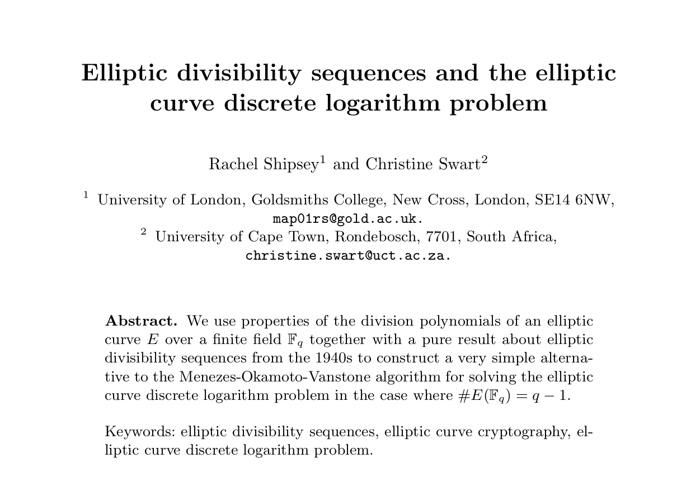

# Elliptic Divisibility Sequences and The Elliptic Curve Discrete Logarithm Problem
Unofficial [LeetArxiv](https://leetarxiv.substack.com/p/elliptic-divisibility-sequences-dlp) Implementation of the paper _Elliptic Divisibility Sequences and The Elliptic Curve Discrete Logarithm Problem_



*LeetArxiv is a successor to Papers with Code after the latter shutdown*. This paper's complete walkthrough is available [here](https://leetarxiv.substack.com/p/elliptic-divisibility-sequences-dlp).

If you found this useful then we offer weekly, curated paper implementations on [Substack](https://leetarxiv.substack.com/p/elliptic-divisibility-sequences-dlp).

## Paper Summary
The authors demonstrate how to convert the Elliptic Curve Discrete Logarith Problem (ECDLP) to an Elliptic Divisibility Sequence Problem (EDSP). Complete walkthrough is available [here](https://leetarxiv.substack.com/p/elliptic-divisibility-sequences-dlp).

## Getting Started

### Evaluate Division Polynomials at a point P
```
python3 EvaluatePolynomials.py
```

### Verify the ECDLP-EDSP Identity
```
python3 VerifyIdentity.py
```


